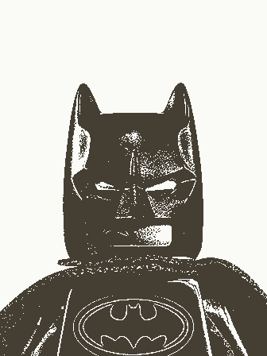
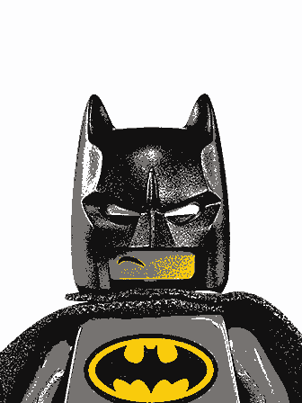
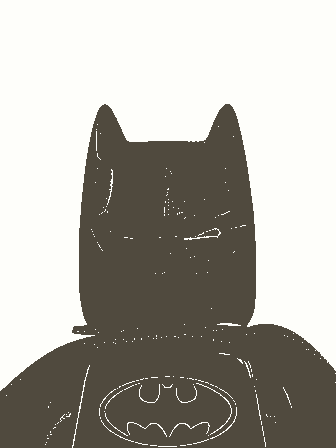
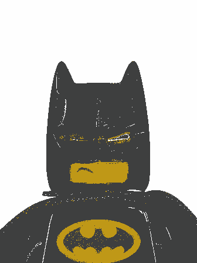
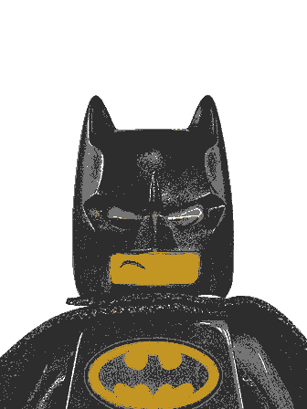

# Finding dominant Colors In and Image

## K-Means

K-Means can efficiently differentiate colors (Implement color segmentation) and with advanced methods K-Means is highly efficient. But, K-Means being a machine learning algorithm, it  may not be deterministic (We might not get correct result everytime). To make K-means more deterministic, we run K_means multiple times, but this leads to increased runtime.
    
The leftmost image shown following is the original image  and the following images were reconstructed using number of colors equal to 1, 2, 3, 4, 5, 6, 7 and 8 respectively.
    

</p

It can be seen that with less number of color components, GMM results are not as accurate, but the results are amazing
